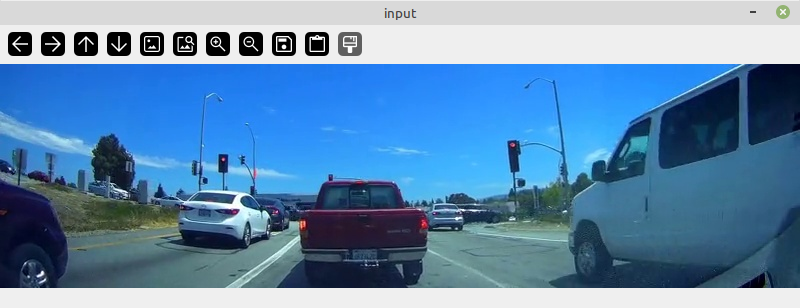
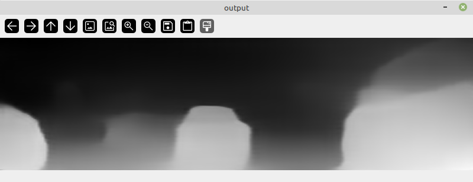

This example shows how to apply the [MiDaS](https://github.com/isl-org/MiDaS)
monocular depth estimation model to images from a video and displays the 
depth information as grayscale images.

## Requirements

**NB:** No GPU required.

Additional image-dataset-converter libraries:

* [image-dataset-converter-imgvis](https://github.com/waikato-datamining/image-dataset-converter-imgvis)
* [image-dataset-converter-video](https://github.com/waikato-datamining/image-dataset-converter-video)

## Data

### Input



### Output




## Preparation

NB: Place all the downloads in the current directory

* Download the [dashcam01.mp4](https://github.com/lessthanoptimal/BoofCV-Data/blob/master/example/tracking/dashcam01.mp4) video from the BoofCV project
* Download the [dpt_levit_224](https://github.com/isl-org/MiDaS/releases/download/v3_1/dpt_levit_224.pt) model (for more, see [here](https://github.com/waikato-datamining/monocular-depth/tree/main/midas3.1_cpu#models))
* The host machine must have a Redis server instance running. Two options:

    1. Install it natively via `sudo apt-get install redis` (and then restart it with `sudo systemctl restart redis`)
    2. Spin up a docker container with: `docker run --net=host --name redis-server -d redis`
  

## MiDaS model

The following command launches the MiDaS model via the container's `midas_predict_redis` command,
running on the CPU: 

```bash
docker run \
    --net=host -u $(id -u):$(id -g) \
    -v `pwd`:/workspace \
    -v `pwd`/cache:/.cache \
    -it waikatodatamining/midas:3.1_cpu \
  midas_predict_redis \
    --redis_in images \
    --redis_out predictions \
    --model_weights /workspace/dpt_levit_224.pt \
    --model_type dpt_levit_224 \
    --prediction_format numpy
```

## image-dataset-converter

The following pipeline loads every 2nd frame from the dashcam01.mp4 video,
tees off the input image into its own viewer, then obtains the depth 
information from the MiDaS model (using the Redis backend), turns
the predictions into grayscale images and then displays them in another
viewer window:

```bash
idc-convert \
  -l INFO \
  from-video-file \
    -i ./dashcam01.mp4 \
    -n 2 \
    -t dp \
  tee -f "image-viewer -t input -p 0,50 -s 800,224 -d 1" \
  redis-predict-dp \
    --channel_out images \
    --channel_in predictions \
    --data_format numpy \
    --timeout 1.0 \
  depth-to-grayscale \
    -t dp \
  any-to-rgb \
  image-viewer \
    -t output \
    -p 0,400 \
    -s 800,224 \
    -d 1
```
