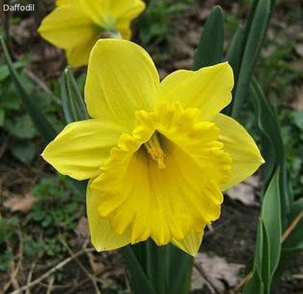

# Requirements

Requires the [image-dataset-converter-imgvis](https://github.com/waikato-datamining/image-dataset-converter-imgvis) module.


# Plugins

## Annotation overlays (image classification)  

Download the [17 flowers](https://datasets.cms.waikato.ac.nz/ufdl/17flowers/) 
*image classification* dataset and extract it.

Having annotations separate from the images is a necessity when training models, but it 
can be a hindrance when trying to inspect the data. Adding overlays with the annotations
is therefore a useful step sometimes.

The following command using the `add-annotation-overlay-ic` filter adds the labels to the 
images and just outputs these modified images: 

```bash
idc-convert -l INFO \
  from-subdir-ic \
    -l INFO \
    -i ./subdir/ \
  add-annotation-overlay-ic \
    -l INFO \
  to-data \
    -l INFO \
    -o ./17flowers-ic-overlay
```

Here is an example (image_0008.jpg):




## Annotation overlays (object detection)  

Download the [17 flowers](https://datasets.cms.waikato.ac.nz/ufdl/17flowers/) 
*object detection* VOC XML dataset and extract it.

With the `add-annotation-overlay-od` filter you can overlay the objects on the images: 

```bash
idc-convert -l INFO \
  from-voc-od \
    -l INFO \
    -i "./voc/*.xml" \
  add-annotation-overlay-od \
    -l INFO \
  to-data \
    -l INFO \
    -o ./17flowers-od-overlay
```

Here is an example (image_0014.jpg):


## Annotation overlays (image segmentation)  

Download the blue channel archive of the [camvid](https://datasets.cms.waikato.ac.nz/ufdl/camvid/) dataset
and extract it.

With the `add-annotation-overlay-is` filter you can overlay the segmentation layers: 

```bash
idc-convert -l INFO \
  from-blue-channel-is \
    -l INFO \
    -i "./bluechannel/*.png" \
    --labels Animal Archway Bicyclist Bridge Building Car CartLuggagePram Child Column_Pole \
             Fence LaneMkgsDriv LaneMkgsNonDriv Misc_Text MotorcycleScooter OtherMoving ParkingBlock \
             Pedestrian Road RoadShoulder Sidewalk SignSymbol Sky SUVPickupTruck TrafficCone \
             TrafficLight Train Tree Truck_Bus Tunnel VegetationMisc Void Wall \
  add-annotation-overlay-is \
    -l INFO \
  to-data \
    -l INFO \
    -o ./camvid-is-overlay
```

Here is an example (0001TP_006900.jpg):


## Combining all annotations in one image

Using the `to-annotation-overlay-od` writer, you can generate a single PNG file that contains
the outlines (bbox or polygon) of your object detection annotations. That way, you can see
whether certain areas are under-represented with annotations and where hotspots are:

```bash
idc-convert -l INFO \
  from-voc-od \
    -l INFO \
    -i "./voc/*.xml" \
  to-annotation-overlay-od \
    -l INFO \
    -o ./17flowers-annotations-overlay.png
```

The 17 flowers dataset looks like this:


