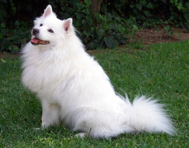
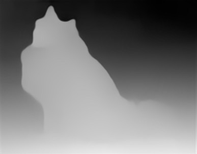

[MiDaS](https://pytorch.org/hub/intelisl_midas_v2/) computes relative inverse 
depth from a single image.

Here is an example application of the small MiDaS model applied to a dog image:





# Requirements

MiDaS support requires the [image-dataset-converter-midas](https://github.com/waikato-datamining/image-dataset-converter-midas) library.


## Generating depth information

The following command loads an image with a dog, generates depth information
using MiDaS, converts the depth information to a grayscale image and
saves that at the end.

```bash
idc-convert -l INFO \
  from-data \
    -l INFO \
    -i {CWD}/input/dog.jpg \
    -t dp \
  apply-midas \
    -l INFO \
  depth-to-grayscale \
    -l INFO \
    -t dp \
  to-data \
    -l INFO \
    -o {CWD}/output
```
