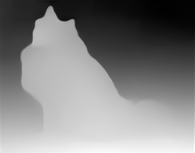

[MiDaS](https://pytorch.org/hub/intelisl_midas_v2/) computes relative inverse 
depth from a single image.

Here is an example of the small MiDaS model being applied to a dog image:





# Requirements

MiDaS support requires the [image-dataset-converter-midas](https://github.com/waikato-datamining/image-dataset-converter-midas) library.


## Generating depth information

The following command loads an image with a dog, generates depth information
using MiDaS and saves the depth information as a grayscale PNG image.

```bash
idc-convert -l INFO \
  from-data \
    -l INFO \
    -i {CWD}/input/dog.jpg \
    -t dp \
  apply-midas \
    -l INFO \
  to-grayscale-dp \
    -l INFO \
    --annotations_only \
    -o {CWD}/output
```
