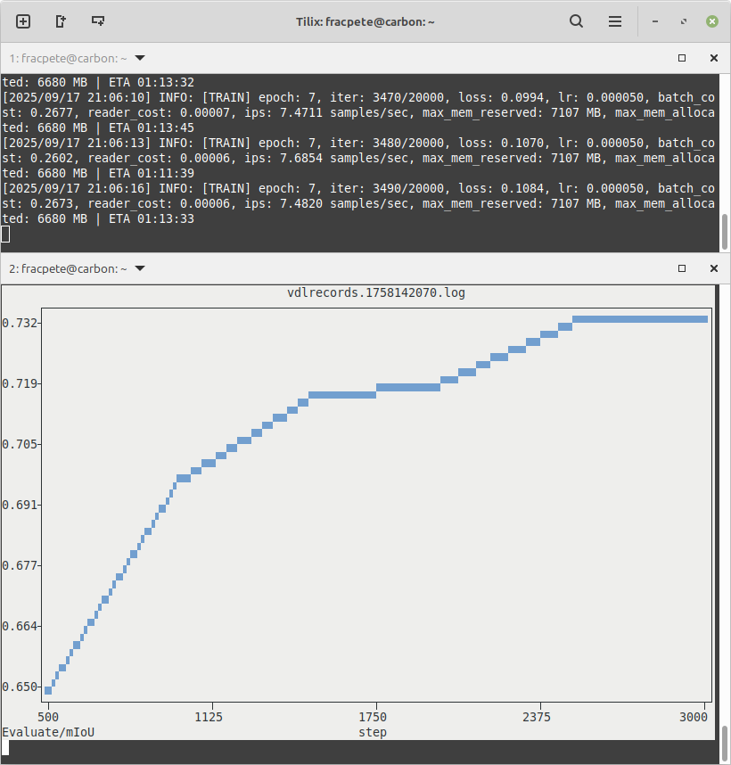

# Requirements

Paddle support requires the [image-dataset-converter-paddle](https://github.com/waikato-datamining/image-dataset-converter-paddle) library.


## Image classification

With the following command, a sub-dir structured is converted into Paddle
format. The integer ID/label text mapping is stored in `./paddle/labels.map`,
the label ID/file mapping in `files.txt` and the images are stored relatively
to the output directory in the `jpg` sub-directory:

```bash
idc-convert -l INFO \
  from-subdir-ic \
    -l INFO \
    -i ./subdir \
  to-paddle-ic \
    -l INFO \
    -o ./paddle \
    --id_label_map ./paddle/labels.map \
    --file_label_map files.txt \
    --relative_path jpg
```

The following converts all Paddle `.txt` files with image/label definitions 
back into sub-directory format:

```bash
idc-convert -l INFO \
  from-paddle-ic \
    -l INFO \
    -i ./paddle/*.txt \
    -m ./paddle/label_list.map \
  to-subdir-ic \
    -l INFO \
    -o ./subdir/
```

## Image segmentation

The following converts indexed PNGs into Paddle's image segmentation format:

```bash
idc-convert -l INFO \
  from-indexed-png-is \
    -l INFO \
    -i ./indexed/*.png \
    --labels l1 l2 l3 l4 \
  to-paddle-is \
    -l INFO \
    -o ./paddle
```

And this command converts the Paddle format into indexed PNGs again:

```bash
idc-convert -l INFO \
  from-paddle-is \
    -l INFO \
    -i ./paddle/*_list.txt \
    --labels_file ./paddle/labels.txt \
  to-indexed-png-is \
    -l INFO \
    -o ./indexed
```

## Plotting VisualDL log files

When building, e.g., image segmentation models, Paddle can output the progress
in [VisualDL](https://github.com/PaddlePaddle/VisualDL) log files. Typically,
these are visualized with the `visualdl` binary and viewed in the browser.
When this is not an option, e.g., when in a headless environment on a server,
then you can still generate simple text-based plots in the terminal via
the `to-terminal-plot` writer of the [kasperl-plots](https://github.com/waikato-datamining/kasperl-plots) 
library.

The example pipeline below monitors the `./logs/` directory  for any 
modifications to `.log` files. It then reads the modified file using the 
`from-visualdl` reader, generating a plot for the `Evaluate/mIoU` scalar
(use the `idc-visualdl-info` tool to inspect VisualDL log files) and 
displays it using `to-terminal-plot`:

```bash
idc-convert \
    watch-dir \
      -i "./logs/" \
      -e ".log" \
      -E modified \
      -a nothing \
      -p never \
      -b "from-visualdl -l INFO -c scalar -t Evaluate/mIoU" \
    to-terminal-plot
```

Below is a screenshot with two terminal sessions, one training a PaddleSeg
model, and the other one monitoring/plotting the log file of the training run: 


