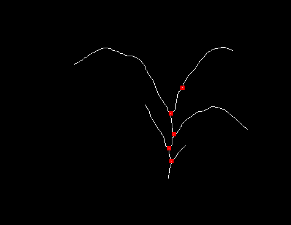

# Requirements

Requires the [image-dataset-converter-plantcv](https://github.com/waikato-datamining/image-dataset-converter-plantcv) library.

# Example input

The following binary image of a plant has been taken from 
[this plantcv tutorial](https://plantcv.readthedocs.io/en/stable/tutorials/morphology_tutorial/):


# Skeletonize a plant

The pipeline below turns the binary image of a plant into a skeleton representation, i.e., 1-pixel wide:

```bash
idc-convert \
  -l INFO \
  from-data \
    -l INFO \
    -t od \
    -i {CWD}/input/plant_binary.png
  pcv-dilate \
    -k 3 \
    -i 1 \
  pcv-erode \
    -k 3 \
    -i 1 \
  pcv-fill \
    -s 30 \
  pcv-fill-holes \
  pcv-skeletonize \
    -p \
    -s 50 \
  pcv-skeletonize \
    -p \
    -s 50 \
  to-data \
    -l INFO \
    -o {CWD}/output
```

Generates the following output:


# Find branches

The pipeline below turns the binary image of a plant into a skeleton representation, i.e., 1-pixel wide:

```bash
idc-convert \
  -l INFO \
  from-data \
    -l INFO \
    -t od \
    -i {CWD}/input/plant_binary.png
  pcv-dilate \
    -k 3 \
    -i 1 \
  pcv-erode \
    -k 3 \
    -i 1 \
  pcv-fill \
    -s 30 \
  pcv-fill-holes \
  pcv-skeletonize \
    -p \
    -s 50 \
  pcv-find-branch-points \
  to-adams-od \
    -l INFO \
    -o {CWD}/output
```

Generates the following output (annotations overlaid onto skeletonized image):


